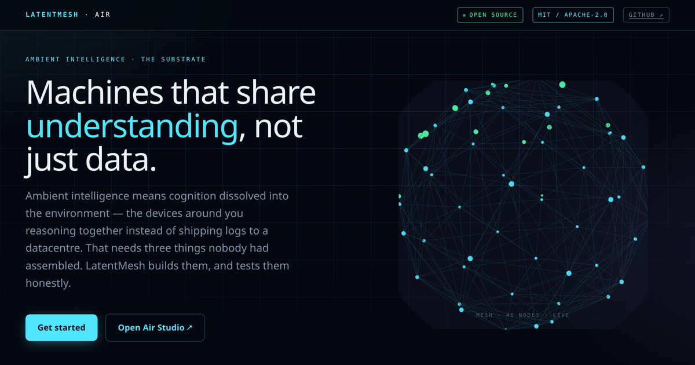
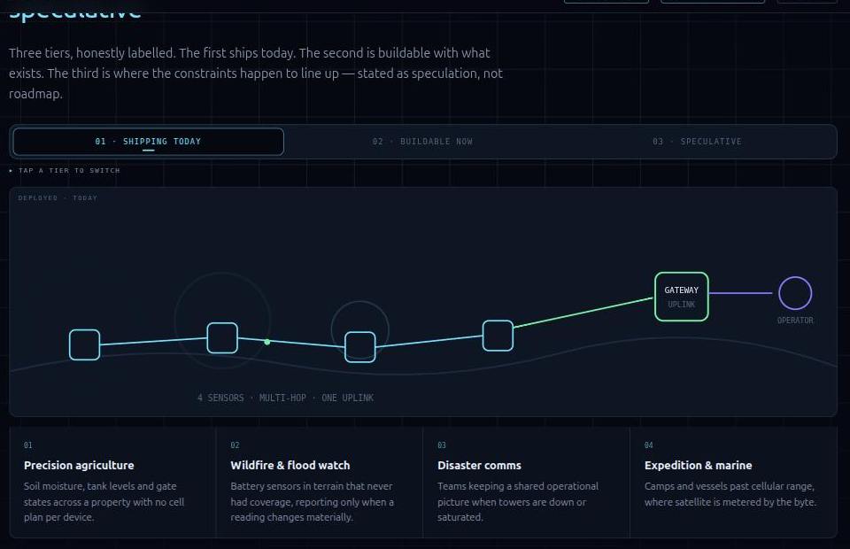
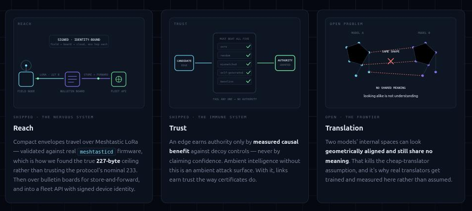

<div align="center">

# LatentMesh

### AI agents that keep working where the internet doesn't reach

**Coordinate AI agents over LoRa, ham radio, Bluetooth, WiFi or plain audio — no cloud, no cell towers, no subscription. Runs on a $10 microcontroller.**

[](#license)
[](#workspace)
[](#pick-your-layer)
[](docs/adr/README.md)
[](#honest-status)

**[Website](https://ruvnet.github.io/LatentMesh/) · [Air Studio](https://latentmesh-air.ruv.chatgpt.site/) · [Quickstart](#quickstart) · [Applications](#what-people-build-with-it) · [Decisions](docs/adr)**

<a href="https://ruvnet.github.io/LatentMesh/"></a>

<sub><a href="https://ruvnet.github.io/LatentMesh/">▶ Open the interactive site</a></sub>

</div>

---

## The problem, in one paragraph

AI agents normally talk through the cloud. Take away the internet — a farm, a canyon, a vessel forty miles out, a tunnel, a disaster zone — and everything cloud-dependent simply stops. That's a hard edge on where autonomous systems can operate, and **most of the planet is on the wrong side of it.**

LatentMesh lets agents talk **directly to each other** over cheap radios instead.

## Why it's hard

These links are tiny. A long-range radio gives you a few hundred bytes per message and strict limits on how often you may transmit. We measured the real ceiling against live Meshtastic firmware:

> **227 bytes** — not the 233 the protocol nominally implies. Protobuf field overhead needs about 6 bytes of headroom, and 227 is the empirically reliable round-trip size found by binary search against `meshtasticd` v2.7.26.

A conversation log has no chance of fitting. So instead of shipping transcripts, each agent sends a compact **semantic envelope**:

| Field | Purpose |
|---|---|
| **What changed** | the delta, not the whole state |
| **How much it matters** | so the receiver can prioritise under scarcity |
| **Facts that must be exact** | carried deterministically, never compressed away |
| **A state fingerprint** | so the receiver can detect that its picture has drifted |

Messages queue when a node goes out of range and forward when it returns. Anything failing its checksum, signature, replay window or reassembly is **dropped** — never waved through because it looked close enough.

---

## Quickstart

Everything below runs on a laptop with **no radio hardware at all** — the transport simulates, so you can build and test the whole path before buying anything.

```bash
git clone https://github.com/ruvnet/LatentMesh
cd LatentMesh
cargo test --workspace
```

Portable C core (allocation-free, for microcontrollers), with sanitizers on:

```bash
cmake -S c -B /tmp/lm-air -DLM_AIR_ENABLE_SANITIZERS=ON
cmake --build /tmp/lm-air
ctest --test-dir /tmp/lm-air --output-on-failure
```

ESP32 decision logic, testable without flashing a board:

```bash
make -C firmware/esp32/host_tests test
```

### Sending your first message

```rust
use latentmesh_meshtastic::{MeshtasticAdapter, OutgoingMessage};

let mut radio = MeshtasticAdapter::new()?;
radio.set_destination(0xffffffff); // broadcast

// One call → the frames your radio should transmit
let frames = radio.encode_message(OutgoingMessage { .. })?;

// Feed bytes back as they arrive; you get a whole message
// once every fragment has landed.
if let Some(msg) = radio.ingest_from_radio(&bytes)? {
    // reassembled, verified, replay-checked
}
```

Reassembly, ordering, duplicate rejection and replay defence are handled for you. A message can span up to **32 fragments**.

---

## What people build with it

<a href="https://ruvnet.github.io/LatentMesh/#applications"></a>

**Shipping today** — precision agriculture across hundreds of hectares with no cell plan per device · wildfire and flood sensors in terrain that never had coverage · disaster comms when towers are down or saturated · expedition and marine, past cellular range where satellite is billed by the byte.

**Buildable now** — robot and drone swarms sharing a world model over radio · split inference, where a small on-site model escalates only a bounded delta · livestock tracking without per-animal connectivity · grid and pipeline telemetry along long linear infrastructure.

**Speculative, and labelled that way** — interplanetary relay, where a protocol built for bounded messages and local decision authority fits better than one assuming an interactive link · subsea acoustic channels that fail in the same shape as HF · post-infrastructure civic mesh. *Nothing here has flown.*

---

## Hardware

| You have | You get |
|---|---|
| **Nothing** | Simulated transport — the full path on a laptop |
| **2 × LoRa boards** (~$25–40 each) | A real two-node mesh, any Meshtastic-supported board |
| **ESP32-S3** | Runs the firmware directly — WiFi UDP, BLE, KISS UART, I²S audio |
| **A handheld radio** | Licensed operators: audio tones through gear you already own |

RF licensing, power limits and band rules are yours to comply with. LatentMesh owns the bytes above the transceiver and deliberately nothing that touches transmit legality.

---

## Pick your layer

Each layer is usable on its own. Take the whole stack or a single crate.

| You want to… | Use |
|---|---|
| Put agent messages on a LoRa mesh | `latentmesh-meshtastic` |
| Build frames for any other radio | `latentmesh-air-core` — `no_std` capable |
| Drive audio or IQ hardware directly | `latentmesh-air-radio` — AFSK, CPFSK, BPSK |
| Bridge the mesh to online services | `latentmesh-agentbbs-bridge` |
| Keep shared memory across a fleet | `latentmesh-memory`, `latentmesh-federation` |
| Run on a microcontroller | portable C11 core, or `firmware/esp32` |
| Test whether a channel earns its bandwidth | `latentmesh-gate` |

---

## The three pillars

<a href="https://ruvnet.github.io/LatentMesh/"></a>

Ambient intelligence — devices around you reasoning together rather than shipping logs to a datacentre — needs three things. Two are built. The third is honestly unfinished, and this repo says which is which.

- **Reach** *(shipped)* — envelopes travel over Meshtastic LoRa, bulletin boards for store-and-forward, and into a fleet API with signed device identity.
- **Trust** *(shipped)* — an edge earns authority only by **measured causal benefit** against decoy controls, never by claiming confidence. Ambient intelligence without this is an ambient attack surface.
- **Translation** *(open)* — two models' internal spaces can look geometrically aligned and still share **no meaning**. Looking alike is not understanding, which kills the cheap-translator assumption.

---

## Honest status

LatentMesh is a **research prototype under active development**, and the repo is explicit about the boundary:

- **Implemented and tested** — semantic transport, framing, FEC, interleaving, fragmentation, replay defence, the Meshtastic adapter (validated against real firmware over TCP), the portable C11 core, and ESP32-S3 targets.
- **Not built, and not implied** — the learned-radio stages on the roadmap are marked as future work rather than described in the present tense.
- **Every performance claim traces to a committed measurement.** Experiments store the comparisons that could contradict them, not only the flattering ones.

The project's founding idea — agents exchanging raw internal state instead of text — was tested across six pre-registered experiments and **did not change decisions**. That result is published rather than buried; the transport built to test it is the part that survived, and it's substantially larger than the experiment that motivated it. See [`docs/research`](docs/research) for the full write-ups.

---

## Documentation

- **[Website](https://ruvnet.github.io/LatentMesh/)** — animated explainer, applications, quickstart
- **[Air Studio](https://latentmesh-air.ruv.chatgpt.site/)** — interactive engineering console
- **[Architecture decisions](docs/adr)** — 47 ADRs, each stating what's real and what isn't
- **[Research](docs/research)** — experiment write-ups, including the negative results

## License

MIT OR Apache-2.0, at your option.

<div align="center">
<sub><b>Keywords</b>: off-grid AI agents · LoRa mesh networking · Meshtastic · agent-to-agent communication ·
ambient intelligence · edge AI · ESP32 · ham radio data · disaster communications ·
multi-agent coordination · semantic compression · no_std Rust</sub>
</div>
