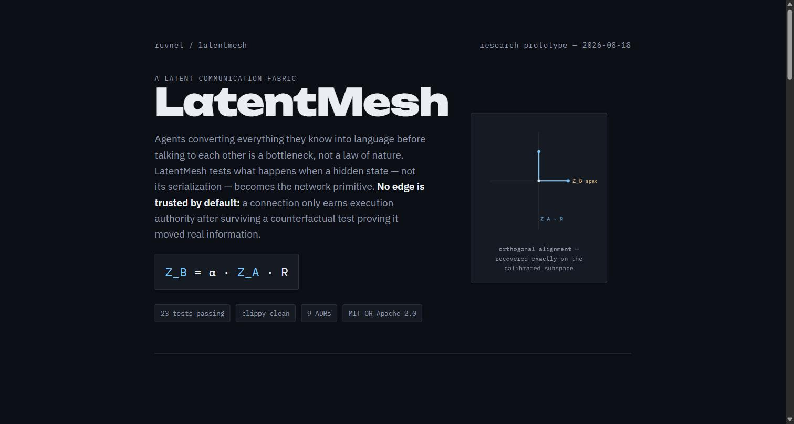

<div align="center">

# LatentMesh

### A causally-verified latent communication fabric for continuously evolving agent collectives

[](#license)
[](#workspace)
[](#honest-status)
[](docs/adr/README.md)

**[LatentMesh Air Studio](https://latentmesh-air.ruv.chatgpt.site/) · [ADRs](docs/adr) · [The original story](https://ruvnet.github.io/LatentMesh/)**

</div>

---

## In plain language

Today, when one AI agent needs to hand a problem to another, it has to explain its whole train of thought in words first — write it out, send it, have the other agent read and re-parse it. That's slow, and a lot gets lost in translation. LatentMesh asks: what if an agent could hand over its actual "thinking" — the internal numbers a model uses before it turns them into words — directly to another agent, skipping the write-it-out-and-read-it-back step entirely?

The catch is that this can't just be trusted blindly. A connection between two agents earns the right to influence anything only after it passes a test proving it actually made the receiving agent smarter — not just busier. Every claimed connection is checked against five decoys (nothing sent, random noise, the wrong topic, talking to itself, and even the old-fashioned written-out version) before it's allowed to matter. Connections that don't clearly help get cut.

This repository is the research prototype: the message format, the math that translates one agent's internal state into another's, the "does this connection actually help" test, and the safety gate that governs who's allowed to act on what. LatentMesh Air now adds a bounded semantic radio protocol, portable C and Rust transmitters and receivers, ESP32 firmware adapters, and an evidence-labelled optimization harness. Fourteen design records explain what is implemented, what remains simulated, and what still requires real radio hardware.

<p align="center">
  <a href="https://ruvnet.github.io/LatentMesh/">
    
  </a>
  <br>
  <sub><a href="https://ruvnet.github.io/LatentMesh/">→ ruvnet.github.io/LatentMesh — the full illustrated story</a></sub>
</p>

---

## LatentMesh Air

LatentMesh Air changes the optimization target from bits delivered to useful
knowledge delivered per hertz, joule, and second.

```text
agent state → semantic delta → importance → adaptive encoding → radio
           → confidence-gated receiver → state reconciliation → authority gate
```

The first release remains radio agnostic. It can move the same bounded semantic
envelope through packet bytes, PCM audio, or complex IQ samples while retaining
deterministic critical facts, priorities, replay defense, compact state hashes,
and optional application signatures. Learned likelihood correction is bounded
by a confidence gate and cannot bypass CRC, signature verification, replay,
reassembly, or state consistency checks. WorldGraph provenance and authority
gates remain integration work.

| Layer | Implemented now | Deliberate boundary |
|---|---|---|
| Semantic transport | `LMS1` envelope, deterministic `LMAD` state delta, importance, residual bytes, state hash, fragmentation, replay window | Cross-model semantic projection and WorldGraph reconciliation remain integration work |
| Rust | `latentmesh-air-core` and `latentmesh-air-radio`, `no_std` capable core, WiFi, BLE, HF, VHF, AM, FM and ham profiles | Hardware drivers stay below the transport abstraction |
| Portable C11 | Allocation-free framing, FEC, interleaving, transmit and receive state machines, BPSK IQ, CPFSK and AFSK PCM, neural LLR assist | External transceiver, TNC, SDR, filtering, antenna and operator remain responsible for legal RF |
| ESP32 S3 | WiFi UDP, BLE fragmentation, KISS UART, I2S audio bridge, bounded queues, replay state, metrics and fail-closed transmit policy | ESP32 does not directly synthesize compliant HF or VHF RF |
| MetaHarness | Frozen policy domains, holdout and anchor suites, signed replay evidence, stage-separated benchmark receipt | Current evaluator is deterministic simulation, not over-the-air evidence |

The migration path is intentionally staged:

```text
semantic transport → neural receiver → adaptive PHY → learned components
                   → experimental end-to-end learned radio
```

Every stage is benchmarkable without pretending the later stages already
exist. See [ADRs 010 through 014](docs/adr/README.md) and the
[interactive engineering Studio](https://latentmesh-air.ruv.chatgpt.site/).

### Air evidence, with labels

| Result | Evidence label | What it proves | What it does not prove |
|---|---|---|---|
| C HF framing: 1,800 byte state to 64 byte delta, 16.04 times fewer air bits | Host software benchmark | Framing and FEC cost reduction | Equivalent downstream task accuracy |
| Rust fixture: 65,536 byte dense reference to 173 transmitted bytes, exact critical hash | Deterministic simulation | Bounded semantic delta and state agreement on the fixture | General semantic quality or RF performance |
| Rust impaired channel fixture: 128 of 512 classical bits versus 448 of 512 assisted bits | Deterministic simulation | Confidence-gated assist can improve this frozen synthetic channel | Generalization, energy gain, or hardware RF performance |
| MetaHarness 64-case degraded suite: 1.07 times neural physical-layer gain | Deterministic simulation, target not met | The wider frozen suite catches the narrow fixture's lack of generalization | Hardware or over-the-air performance |
| C codec: roughly 470,000 encode plus decode frames per second | Host benchmark | Portable codec headroom on this runner | ESP32 timing or end-to-end radio throughput |

The binding research gates are separate: at least ten times less transmitted
data with equivalent downstream task accuracy for the semantic layer, then at
least two times additional task-weighted useful information per airtime or
energy for the neural physical layer under held-out degraded channels, while
maintaining 99 percent critical WorldGraph agreement. These hardware gates have
not yet passed. The exact protocol is in
[the acceptance contract](docs/air/ACCEPTANCE.md).

### Run Air locally

```bash
# Rust
cargo test --workspace

# Portable C with sanitizers
cmake -S c -B /tmp/latentmesh-air-c -DLM_AIR_ENABLE_SANITIZERS=ON
cmake --build /tmp/latentmesh-air-c
ctest --test-dir /tmp/latentmesh-air-c --output-on-failure

# ESP32 pure host logic
make -C firmware/esp32/host_tests test

# Deterministic MetaHarness evaluator
cd harness/air
npm install --ignore-scripts
npm run validate
```

---

> Agents should not need to convert everything they know into language before communicating with another agent. LatentMesh is a research prototype exploring what happens when an agent's hidden state — not its serialized text — becomes the network primitive. It is not a claim that this is unclaimed territory: as of 2026-08-18, [StateBridge](docs/adr/001-latentmesh-architecture-and-prior-art.md), LatentMAS, AVP, and AAFLOW+ already occupy most of the wire-format and raw-transfer ground, and [E2 Explainer](docs/adr/009-online-causal-control-loop.md) and MANTA already do causal attribution and dynamic topology respectively. What this repo bets on instead: **an agent-to-agent latent edge only earns execution authority if it survives a counterfactual test proving it transferred real information** — a continuously-running control loop, not a wire format. See [ADR-001](docs/adr/001-latentmesh-architecture-and-prior-art.md) and [ADR-009](docs/adr/009-online-causal-control-loop.md) for the full, corrected positioning — including where the claim narrowed after a second literature pass in the same day it was written.

## The loop

```
execute → transfer latent state → counterfactual audit → measure causal value
  → update edge authority → persist result → change topology → next execution
```

Instead of:

```
Agent A → generate tokens → serialize text → network → tokenize text → Agent B
```

a `LatentFrame` carries an aligned hidden-state slice directly, and — the actual bet — **no edge is trusted by default**. Every candidate edge `A → B` is tested against five controls (zero state, random state, mismatched-task state, self-generated state, and the *text-equivalent* of the same content) before it may influence anything beyond passive observation. Beating `text_equivalent` specifically is what makes a surviving edge a claim about latent communication, not merely about communication-vs-silence.

```rust
struct LatentFrame {
    id: String,
    sender_model: String,
    receiver_space: String,   // the embedding space this frame is aligned FOR
    transform_hash: String,   // content hash of the R/α actually used
    sequence: u64,             // streaming order
    payload: Payload,          // { encoding: F32|F16|Int8, dim, bytes, int8_params }
    confidence: f32,           // measured alignment-fit quality, in [0,1]
    provenance: Provenance,    // sender_model, context_hash, parents[]
    authority: Authority,      // ObserveOnly < ContextInject < LatentPrefix < ActionInfluencing
    timestamp: u64,
}
```

## Structural guarantees (in the types and the tests, not in policy docs)

- **An edge earns authority; it is never granted it by default** — an edge absent from the gate's policy defaults to `ObserveOnly` regardless of what it requests (`latentmesh-gate`, `Gate::admit`, tested).
- **Causally-unverified edges are structurally capped below `ActionInfluencing`** — `ceiling_from_verdict` maps a rejected/untested edge to `ObserveOnly`; only a statistically significant `ΔV` against all five controls raises the ceiling (tested).
- **The admission gate returns the FIRST violated rule**, in the same deterministic, clock-free, independently-re-runnable style as [`cognitum-one/slack`'s AGL module](https://github.com/cognitum-one/slack/blob/main/docs/adr/0009-agl-admission-module.md) — this repo ports that shape from code-mutation governance onto latent-execution governance (ADR-008).
- **The causal test is nonparametric** — a sign-flip permutation test, no assumption that task-value noise is Gaussian or continuous (`latentmesh-gate::causal`, tested for false-positive rate under the null and invariance to positive rescaling).
- **The risk score is an explicit, documented placeholder**, not a trained trajectory-risk model — using it as if it were validated would misrepresent this repo's safety posture, so it's named as a stand-in in the code and in [ADR-008](docs/adr/008-capability-governed-execution.md), not buried in a footnote.

## Workspace

| Crate | What it does | ADR |
|---|---|---|
| [`latentmesh-core`](crates/latentmesh-core) | `LatentFrame`, `Encoding` (F32/F16/Int8 with real per-tensor affine quantization), `Payload::wire_bytes()` (exact, not estimated), `Provenance`, `Authority` | [002](docs/adr/002-latent-packet-protocol.md) |
| [`latentmesh-align`](crates/latentmesh-align) | Training-free orthogonal alignment (Procrustes/SVD); optimized `O(d²n)` fast path (QR + small SVD) for the realistic same-dim, few-calibration-pairs case, verified against the `O(d³)` dense reference | [002](docs/adr/002-latent-packet-protocol.md) |
| [`latentmesh-gate`](crates/latentmesh-gate) | The admission gate (`execute(z) ⟺ signature ∧ authority ∧ provenance ∧ risk<τ`) and causal edge verification (five-control permutation test) | [003](docs/adr/003-causal-edge-verification.md), [008](docs/adr/008-capability-governed-execution.md) |
| [`latentmesh-bench`](crates/latentmesh-bench) | Real, measured numbers only — no live LLM access, so no claimed cross-model task accuracy; measures wire bytes and alignment/verification wall-clock | [002](docs/adr/002-latent-packet-protocol.md) |
| [`latentmesh-air-core`](crates/latentmesh-air-core) | Bounded cross-language air frame, semantic envelope, deterministic state delta, CRC32C, replay defense, fragmentation and FEC | [010](docs/adr/010-latentmesh-air-protocol.md) |
| [`latentmesh-air-radio`](crates/latentmesh-air-radio) | Packet, PCM and IQ transmitter and receiver paths with confidence-gated neural likelihood assistance | [012](docs/adr/012-neural-receiver-fallback.md) |

The original four crates retain their 23-test baseline. The two Air crates add
43 tests that passed in isolated Rust validation, including formatting,
Clippy with warnings denied, and `no_std` compilation. The integrated workspace
is also enforced by CI.

## Measured, not asserted

`cargo run --release -p latentmesh-bench` on this machine, before and after the 2026-08-18 optimization ([ADR-002](docs/adr/002-latent-packet-protocol.md)):

| dim | calibration pairs | fit — before | fit — after | speedup |
|---|---|---|---|---|
| 64 | 16 | 0.171 ms | 0.073 ms | 2.3× |
| 256 | 16 | 13.4 ms | 0.37 ms | 36× |
| 1024 | 16 | 2792 ms | 6.5 ms | **430×** |
| 4096 | 16 | 155,996 ms (~2.6 min) | 161.8 ms | **~964×** |

The "before" number is not a strawman — it's what a direct, textbook dense-SVD orthogonal Procrustes solver actually costs at an LLM-realistic hidden dimension, measured on this repo's own code before the fix. The "after" number comes from exploiting that the calibration set (`n` ≈ 16–64 pairs) makes the transform matrix's true rank far below the embedding dimension — an exact reformulation (`O(d²n)` instead of `O(d³)`), not an approximation; `fast_path_matches_dense_reference` and `fast_path_is_identity_on_the_orthogonal_complement` in `latentmesh-align`'s test suite prove the two paths agree on the calibrated subspace and that the (deliberately chosen) null-space policy — identity on directions with no calibration evidence — holds.

Wire bytes at 16×4096-dim vectors: **256 KiB at F32, 128 KiB at F16, 64.1 KiB at Int8** — exactly matching the back-of-envelope scaling intuition this protocol was built to test, now backed by an actual measurement instead of an assumption.

## Honest status

This is a **research prototype**. What's real: the packet and codec types, the alignment algorithm, causal-verification statistics, admission gate, Air framing and semantic delta, portable C and Rust radio state machines, ESP32 transport adapters, deterministic channel tests, and the MetaHarness policy contract. What's **not** done: no live heterogeneous-model latent integration, no completed RuVector or WorldGraph reconciliation pipeline, no closed-loop semantic knowledge-request scheduler, no trained universal receiver, no compliant end-to-end learned waveform, no ESP32 target build in this workspace, and no hardware-in-the-loop or over-the-air acceptance result. MetaHarness currently evaluates frozen simulated channels; it does not manufacture radio evidence. Every external literature figure remains attributed rather than reproduced. See [ADR-001 §8](docs/adr/001-latentmesh-architecture-and-prior-art.md#8-honest-feasibility), [ADR-009 §6](docs/adr/009-online-causal-control-loop.md#6-honest-bench-numbers-this-repo-this-session--see-root-readme), and [the Air acceptance contract](docs/air/ACCEPTANCE.md).

```bash
cargo build --workspace
cargo test --workspace
cargo clippy --workspace --all-targets -- -D warnings
cargo run --release -p latentmesh-bench              # real measured numbers
```

## Architecture decisions

| ADR | Decides |
|---|---|
| [001](docs/adr/001-latentmesh-architecture-and-prior-art.md) | The north star, and an honest map of prior art |
| [002](docs/adr/002-latent-packet-protocol.md) | The `LatentFrame` packet + alignment algorithm |
| [003](docs/adr/003-causal-edge-verification.md) | The five-control causal test an edge must survive |
| [004](docs/adr/004-streaming-latent-state.md) | Streaming latent frames over MidStream |
| [005](docs/adr/005-persistent-latent-memory.md) | RuVector's raw→compressed→prototype→symbolic memory continuum |
| [006](docs/adr/006-self-evolving-topology.md) | MetaHarness Darwin mutating the topology itself |
| [007](docs/adr/007-federated-world-models.md) | Radio federating compatible transition rules across nodes |
| [008](docs/adr/008-capability-governed-execution.md) | RVF/RVM's capability gate for opaque latent execution |
| [009](docs/adr/009-online-causal-control-loop.md) | The corrected, narrower claim — the closed loop, and one role per existing ruvnet component |
| [010](docs/adr/010-latentmesh-air-protocol.md) | Cross-language bounded air frame and semantic envelope |
| [011](docs/adr/011-radio-adapters-and-legal-boundary.md) | WiFi, BLE, HF, VHF, AM, FM and amateur service adapter boundaries |
| [012](docs/adr/012-neural-receiver-fallback.md) | Confidence-gated neural likelihood assistance with exact DSP fallback |
| [013](docs/adr/013-esp32-firmware.md) | ESP32 S3 firmware architecture, resource limits and transmit interlocks |
| [014](docs/adr/014-benchmark-and-acceptance-method.md) | Stage-separated semantic and physical-layer evidence contract |

## The acceptance test

Three heterogeneous open models, three machines, a task requiring continuous collaboration. **Pass** if latent streaming beats text communication by ≥25% in wall-clock latency or token cost while keeping task accuracy within 2 points — *and*, per [ADR-009](docs/adr/009-online-causal-control-loop.md#5-the-one-experiment-not-a-dozen-repos), more than 80% of the edges a `CausalDynamicLatent` topology retains individually survive the mismatched-state control, not just the aggregate comparison. Neither half alone is sufficient. Not run this session — no live model access; see Honest status above.

## License

MIT OR Apache-2.0, matching ruvnet norm. See [LICENSE-MIT](LICENSE-MIT) / [LICENSE-APACHE](LICENSE-APACHE).
